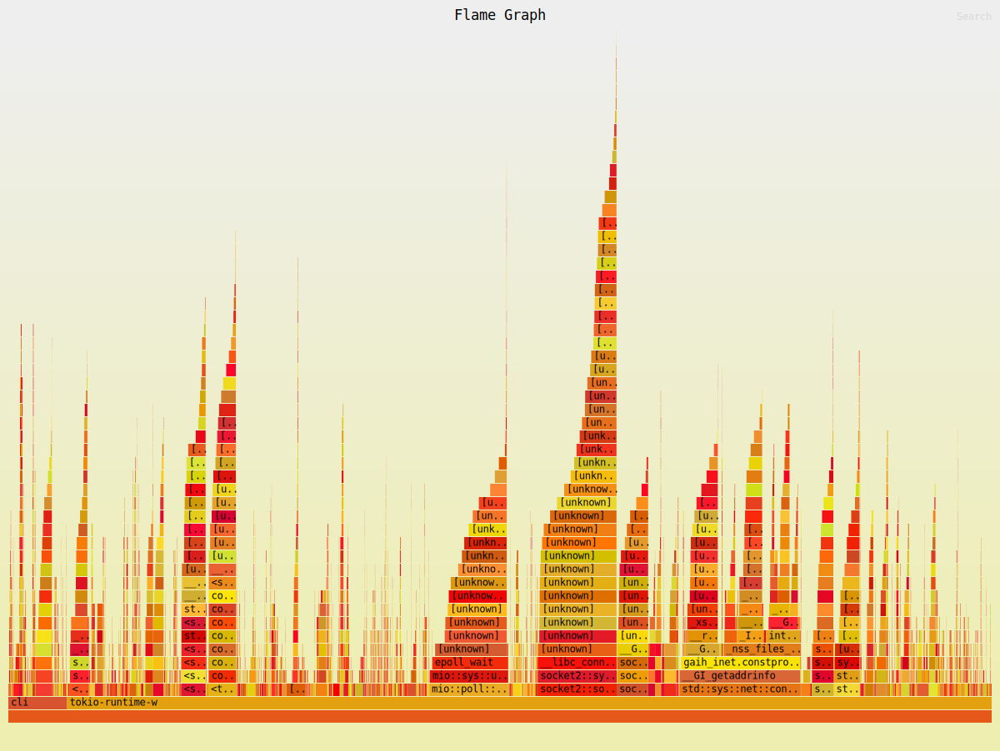

# Memory Profiing Report

Tool: heaptrack + heaptrack_gui
Date: 16-03-2026


## 1. Overview

This report documents the results of memory profiling performed on the
gremlin CLI tool using heaptrack. The objective was to identify memory
hotsports, analyze allocation patterns, and detect memory leaks in the
scan command under realistic conditions.

---


## 2. Test Environment

| Field | Value |
|-------|-------|
| Binary | target/debug/cli |
| Build profile | debug(debug=true)
| Profiling tool | heaptrack |
| Command | scan --url http://localhost/FUZZ --wordlist cli/tests/data/wordlist.txt --concurrency 20 --rate-limit 2 |
| Total runtime | 2081.48 sec | 

---



## 3. Summary Metrics

| Metric | Value |
|--------|-------|
| Peak heap memory consumption | 1.1 MB (after 1,127sec) |
| Peak RSS (including heaptrack overhead) | 93.7 MB |
| Total memory leaked | 216.7 kB |
| Calls to allocation functions | 322,732 (155/s) |
| Temporary allocations | 70,410 (21.82%, 33/sec) |
| Total bytes allocated | 86.25 MB (41.4 kB/s)

---


# 4. Analysis

## 4.1 Heap Usage

Peak heap of 1.1MB is very low. At any given moment, the program holds
minimal data in memory, consistent with streaming architecture that
reads the wordlist line-by-line rather than buffering in full.


## 4.2 Allocation Pattern

86.25 MB was allocated in total against a peak of 1.1 MB, indicating 
rapid allocation and deallocation cycling. This is characteristic of
per-request objects being created and immediately dropped each
iteration. At a rate limit of 2 req/s over 2081s, this maps directly
to per-request construction of Url, HeaderMap, and String in next().

21.82% of allocation are temporary (short-lived), reinforcing this
pattern.


## 4.3 Allocation Sources

The dominant allocation path identified:

```
cli::scan
  -> engine::HttpEngine
    -> reqwest::connect::ConnectorBuilder::new_default_tls
```

This represents a one-time TLS connector initialization at client
startup - not a per-request hotspot. It is expected and not a concnern.

User-defined functions (next, run_generator) did not appear as 
significant allocation sources, likely due to inlining even in debug
buil

This represents a one-time TLS connector initialization at client
startup - not a per-request hotspot. It is expected and not a concnern.

User-defined functions (next, run_generator) did not appear as 
significant allocation sources, likely due to inlining even in debug
build. This suggest allocation overhead in user code is minimal.


## 4.4 Memory Leaks

216.7 kB was not freed by the end of the run. While small relative to
total allocations, the source must be identified. Likely candidates 
are global state, thread-local storage, or resources held by the async
runtime or TLS library that are not explicitly released on shutdown.

---


# 5. Identified Issues

| # | Issue | Severity | Location |
|---|-------|----------|----------|
| 1 | 216.7 kB leaked  | Low | Unknown (likely runtime/TLS shutdown) | 
| 2 | Per-request HeaderMap::new() | Minor | next() |
| 3 | Url::parse - new url constructed per-request | Minor | next() |

---


# 6. Recommendations

- Investigate the 216.7 kB memory leak - run heaptrack with a shorter
  wordlist and inspect the largest memory leaks section of the summary
  for the specific call site.

- Consider reusing HeaderMap across requests if headers are static -
  construct once and clone rather than allocating a new map each
  iteration.

- Url::parse() per request is unavoidable if the path changes each
  iteration, but the base URL parsing can be cached.

- Run profiling against a release build (with debug = true in 
  [profile.release]) to confirm optimized behavior matches debug
  the debug profile.

---


# 7. Conclusion

No significant memory hotsports were identified in user-defined code.
The allocation profile is dominated by HTTP client internals (reqwest/
hyper/rustls), which are expected and outside user control. Peak heap
of 1.1 MB confirms that the streaming design is working correctly.
The only concrete action item is tracking down the source of the 
216.7 kB leak.
